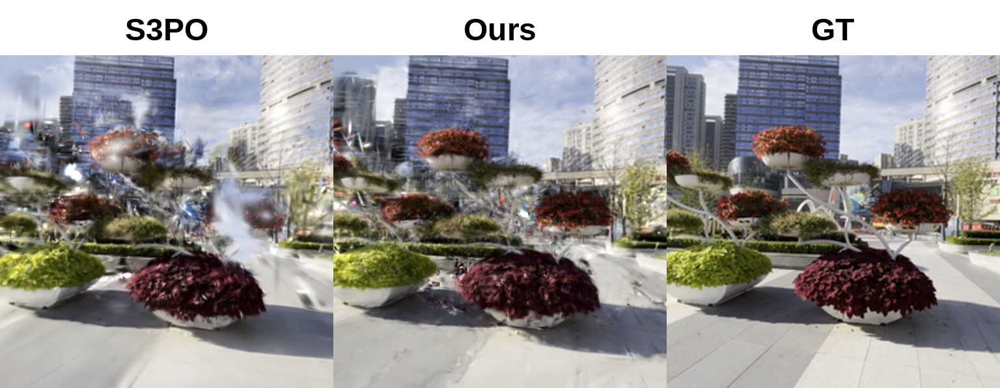
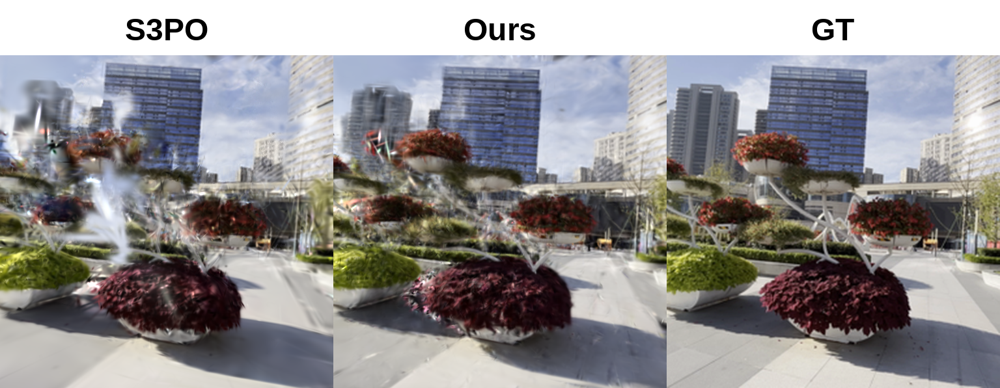
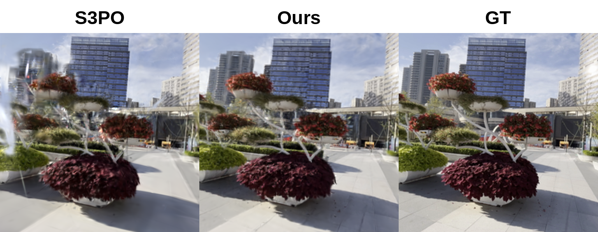
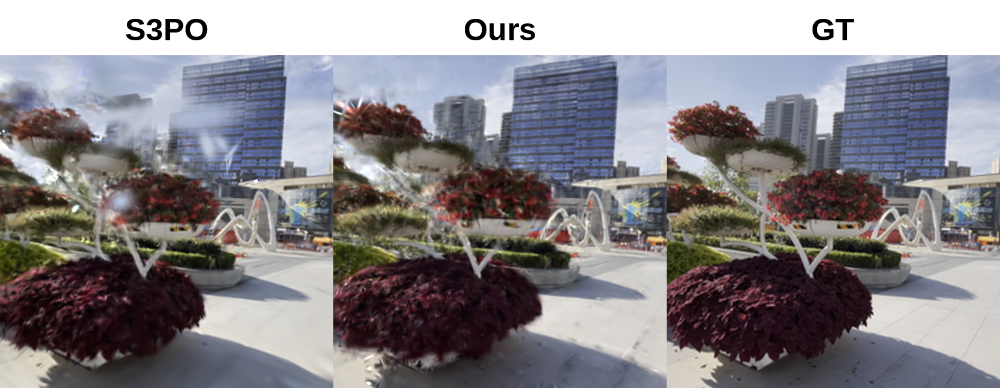
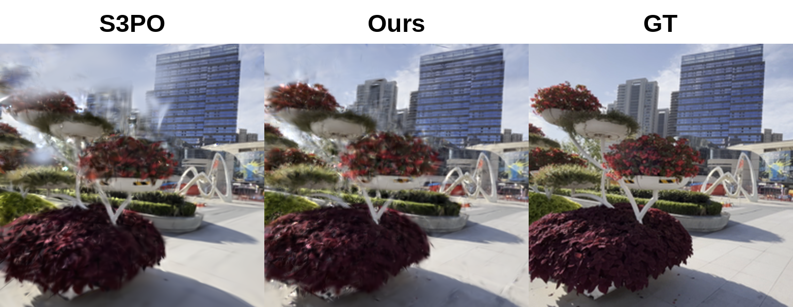
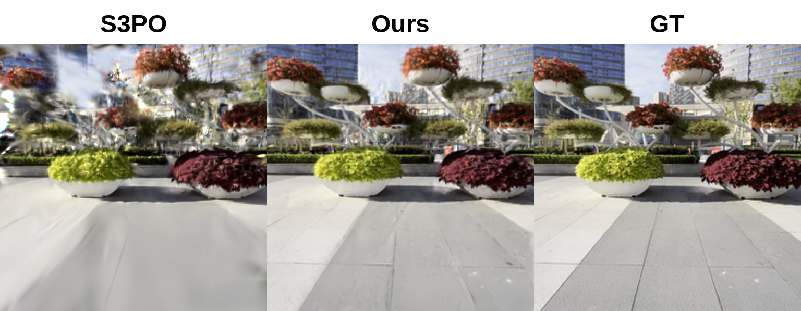
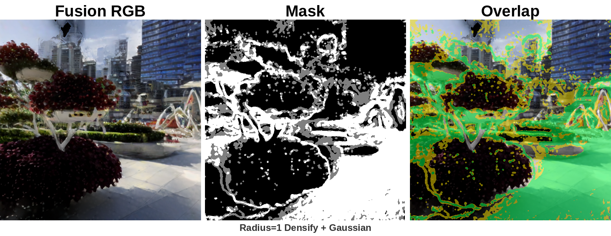
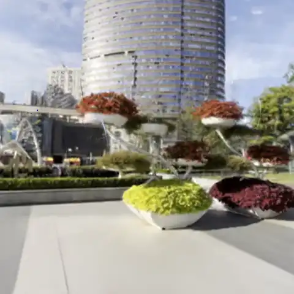
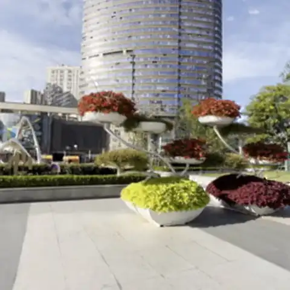

# Part3: BRPO-based Generative Pseudo-View Enhancement for Sparse-View 3DGS SLAM

This project implements **BRPO (Bidirectional Reciprocal Pseudo-view Optimization)** on top of S3PO-GS for enhancing sparse-view 3D Gaussian Splatting SLAM with generative pseudo-views.

## Overview

Sparse-view 3D reconstruction suffers from insufficient supervision in unobserved regions. This project addresses this challenge by:

1. **Pseudo-view Generation**: Generating intermediate views between keyframes using DIFIX diffusion restoration
2. **Joint-Primary Topology**: Placing pseudo-views at midpoint positions with bidirectional correspondence verification
3. **Confidence Masking**: Weighting pseudo-view supervision by correspondence reliability

### Architecture

```
part3_BRPO/
├── pseudo_branch/           # Pseudo-view generation and refinement
│   ├── integration/         # Runtime integration with S3PO backend
│   ├── refine/              # Loss functions, pose optimization
│   ├── mask/                # Confidence mask generation
│   └── common/              # MASt3R matcher utilities
├── online_mapping/          # Online mapping runtime implementation
│   ├── runtime/             # Exact backend, slot selector, DIFIX loader
│   └── records/             # Runtime record builders
├── core_shared/             # Shared kernels (losses, pose, records)
└── slam_replace/            # Modified S3PO-GS files for replacement
    ├── slam.py              # Main entry point
    ├── utils/               # Modified utility files
    │   ├── slam_backend.py
    │   ├── slam_backend_brpo.py
    │   ├── slam_frontend.py
    │   ├── slam_utils.py
    │   ├── camera_utils.py
    │   ├── pose_utils.py
    │   └── internal_eval_utils.py
    └── gaussian_splatting/
        └── loss/
            └── loss_utils.py
```

## Dependencies

- Python 3.11
- PyTorch 2.1.0+cu118
- CUDA 11.8
- NVIDIA GPU with ≥20GB VRAM (tested on RTX A6000)

## Installation

### Step 1: Clone S3PO-GS

```bash
git clone https://github.com/3DAgentWorld/S3PO-GS.git --recursive
cd S3PO-GS
```

### Step 2: Setup Environment

```bash
conda env create -f environment.yml
conda activate s3po-gs
```

Or use the provided environment from this project:

```bash
conda env create -f part3_BRPO/environment.yml
conda activate s3po-gs
```

### Step 3: Compile Submodules

```bash
pip install submodules/simple-knn
pip install submodules/diff-gaussian-rasterization
```

### Step 4: Compile RoPE CUDA Kernels

```bash
cd croco/models/curope/
python setup.py build_ext --inplace
cd ../../../
```

### Step 5: Clone This Project

```bash
git clone <this-repo-url> part3_BRPO
```

### Step 6: Replace S3PO-GS Files

Copy the modified files from `slam_replace/` to S3PO-GS:

```bash
# Root level
cp part3_BRPO/slam_replace/slam.py S3PO-GS/

# utils directory
cp part3_BRPO/slam_replace/utils/*.py S3PO-GS/utils/

# gaussian_splatting/loss directory
mkdir -p S3PO-GS/gaussian_splatting/loss/
cp part3_BRPO/slam_replace/gaussian_splatting/loss/*.py S3PO-GS/gaussian_splatting/loss/
```

**Files replaced:**
- `slam.py` - Main entry point
- `utils/slam_backend.py` - Backend mapping with BRPO integration
- `utils/slam_backend_brpo.py` - BRPO pseudo-view mapping logic
- `utils/slam_frontend.py` - Frontend tracking modifications
- `utils/slam_utils.py` - Utility modifications
- `utils/camera_utils.py` - Camera utility modifications
- `utils/pose_utils.py` - Pose utility modifications
- `utils/internal_eval_utils.py` - Evaluation modifications
- `gaussian_splatting/loss/loss_utils.py` - Loss function modifications

These modified files import modules from `part3_BRPO` via PYTHONPATH.

## Weights

### MASt3R (Dense Matcher)

Download the MASt3R checkpoint for correspondence verification:

```bash
mkdir -p checkpoints/
wget https://download.europe.naverlabs.com/ComputerVision/MASt3R/MASt3R_ViTLarge_BaseDecoder_512_catmlpdpt_metric.pth -P checkpoints/
```

### DIFIX (Diffusion Restoration)

DIFIX model is loaded from HuggingFace. Set cache directory:

```bash
export HF_HOME=/path/to/.cache/huggingface
export HUGGINGFACE_HUB_CACHE=/path/to/.cache/huggingface/hub
export HF_ENDPOINT=https://hf-mirror.com  # For China mirror
```

The model `nvidia/difix_ref` will be automatically downloaded on first use.

## Dataset Preparation

We support DL3DV, Waymo, and Re10k datasets in S3PO-GS format.

## Usage

### Basic Run

```bash
export PYTHONPATH=/path/to/S3PO-GS:/path/to/part3_BRPO:
export CUDA_VISIBLE_DEVICES=0
cd S3PO-GS

python slam.py --config /path/to/config.yaml
```

### Example: DL3DV-2 with BRPO Enhancement

```bash
ulimit -n 65536  # Increase file descriptor limit
export PYTHONPATH=/home/user/S3PO-GS:/home/user/part3_BRPO:
export CUDA_VISIBLE_DEVICES=0
export HF_HOME=/data/.cache/huggingface
export HUGGINGFACE_HUB_CACHE=/data/.cache/huggingface/hub
export HF_ENDPOINT=https://hf-mirror.com

cd /home/user/S3PO-GS
python slam.py --config part3_BRPO/configs/e5c_dl3dv.yaml
```

### Key Configuration Parameters

```yaml
Results:
  brpo_online_mapping:
    enabled: true                    # Enable pseudo-view enhancement
    trigger: keyframe                # Trigger on each keyframe
    topology_mode: joint_primary     # Midpoint pseudo placement
    placement_mode: midpoint_only
    
    use_difix_restoration: true      # Use DIFIX for RGB refinement
    difix_fusion_mode: overlap_confidence_weighted  # Fusion strategy
    
    matcher_mode: dense_pts3d_3d     # MASt3R dense matching
    dense3d_conf_quantile: 0.15      # Confidence threshold
    
    lambda_depth: 0.025              # Depth loss weight
    lambda_pseudo: 1.0               # Pseudo-view loss weight
    num_iterations: 20               # Per-keyframe optimization steps
```

**Important**: Ensure `lambda_depth > 0` for proper depth supervision. Setting `lambda_depth: 0.0` will disable depth loss and significantly degrade results.

## Results

### Quantitative Evaluation

| Dataset | Setting | PSNR ↑ | SSIM ↑ | LPIPS ↓ | ATE RMSE ↓ |
|---------|---------|--------|--------|---------|------------|
| Re10k-1 | S3PO-GS | 23.95 | 0.873 | 0.079 | 0.007 |
| Re10k-1 | Ours | 24.75 | 0.886 | 0.074 | 0.015 |
| Waymo-405841 | S3PO-GS | 24.02 | 0.766 | 0.280 | 2.789 |
| Waymo-405841 | Ours | 24.87 | 0.785 | 0.237 | 1.783 |
| DL3DV-2 | S3PO-GS | 17.48 | 0.615 | 0.354 | 0.463 |
| DL3DV-2 | Ours | 21.93 | 0.721 | 0.228 | 0.041 |

### Visual Results

**Triptych Comparison** (Ground Truth vs. S3PO-GS vs. Ours):

<p float="left">
  
  
</p>

<p float="left">
  
  
</p>

<p float="left">
  
  
</p>

**Mask Strategy Visualization**:



**Video Comparison** (DL3DV-2 scene):

<p align="center">
  
  
</p>

<p align="center"><em>Left: S3PO-GS Baseline | Right: Ours (BRPO Enhancement)</em></p>

## Citation

If you find this work useful, please cite:

```bibtex
@article{cheng2025outdoor,
  title={Outdoor Monocular SLAM with Global Scale-Consistent 3D Gaussian Pointmaps},
  author={Cheng, Chong and Yu, Sicheng and Wang, Zijian and Zhou, Yifan and Wang, Hao},
  journal={ICCV},
  year={2025}
}

@article{brpo2025,
  title={Bidirectional Reciprocal Pseudo-view Optimization for Sparse-View 3D Gaussian Splatting},
  author={...},
  journal={...},
  year={2025}
}
```

## Acknowledgement

This work is built on:
- [S3PO-GS](https://github.com/3DAgentWorld/S3PO-GS) - Outdoor monocular SLAM
- [MASt3R](https://github.com/naver/mast3r) - Dense correspondence matching
- [3DGS](https://github.com/graphdeco-inria/gaussian-splatting) - Gaussian splatting rendering
- [MonoGS](https://github.com/muskie82/MonoGS) - SLAM visualization

## License

MIT License
