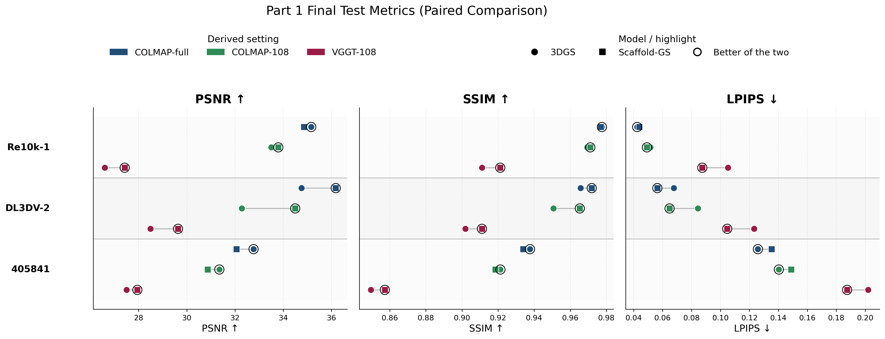
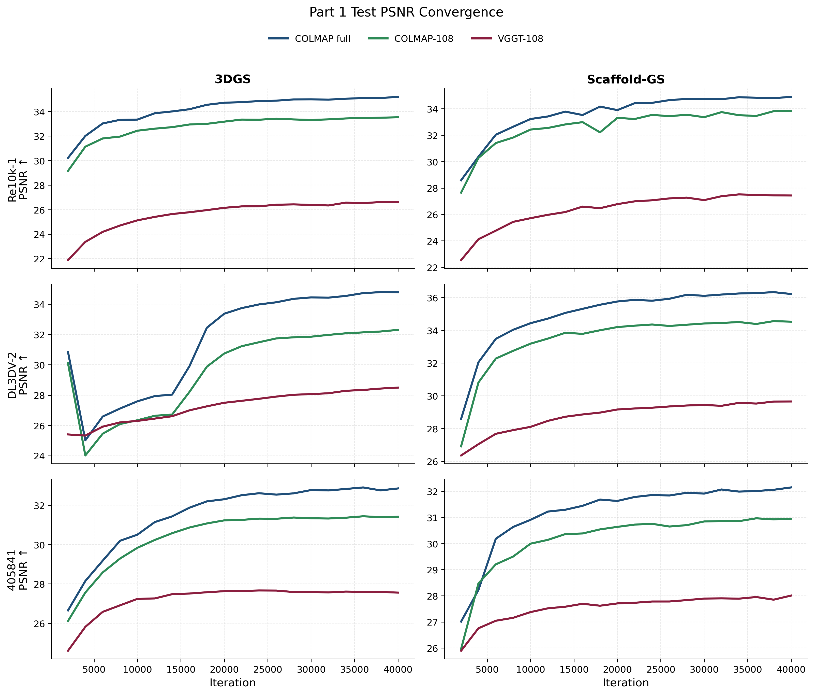
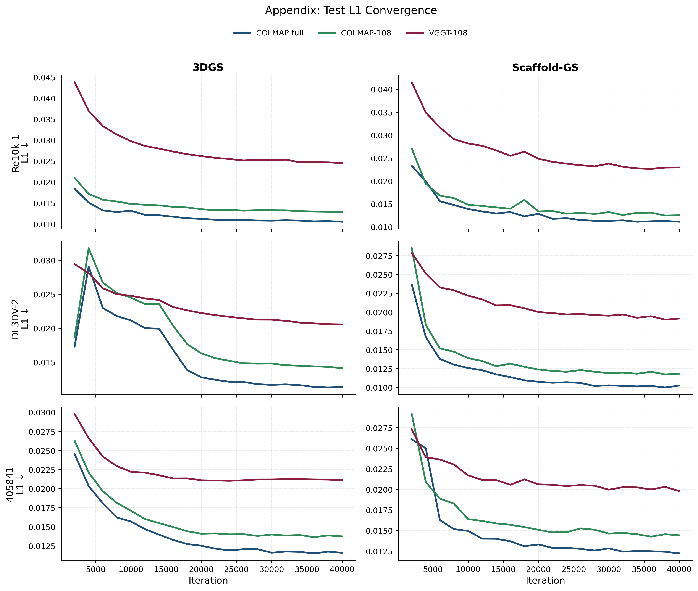
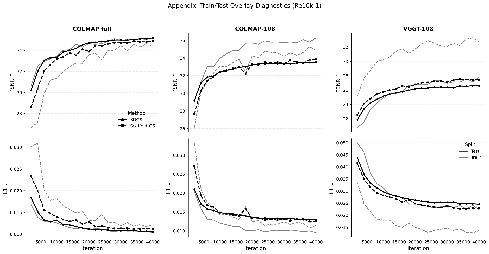
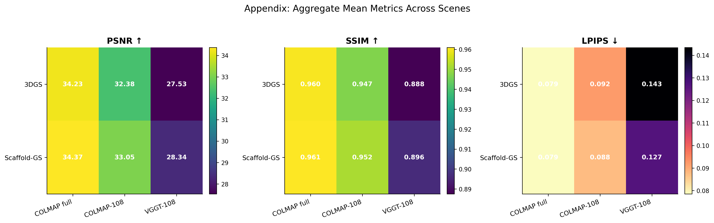

# Part 1 Unified Experimental Report: Initialization, Coverage, and Model Effects in Gaussian Splatting

## Abstract
This report presents a unified analysis of Part 1 experiments across three scenes (Re10k-1, DL3DV-2, and 405841), three initialization settings (COLMAP-full, COLMAP-108, VGGT-108), and two Gaussian rendering backbones (3DGS and Scaffold-GS), for a total of 18 runs under a matched 40k optimization budget. Rather than reporting separate narratives for Plan A and Plan B, we frame the study as a controlled factor analysis with three orthogonal axes: initialization quality, view coverage, and model architecture. The evidence consistently shows that geometry-first initialization remains the dominant factor in final quality, with view coverage as the second-order effect and backbone choice as a scene-dependent third-order effect. We also connect the observed behavior to implementation-level mechanisms in the training code and reconstruction pipeline, including densification schedules, anchor growth policy, and the feedforward-without-BA constraint used in VGGT-108.

## 1. Scope and Experimental Question
The core question of this study is not only which method wins, but why the ranking is stable across scenes. The practical setting is realistic: all methods are trained for 40,000 iterations, evaluated every 2,000 iterations, and compared under matched scene/model combinations. The primary outcome variables are final test PSNR, SSIM, and LPIPS, together with convergence trajectories in test L1 and test PSNR.

From an experimental design perspective, the analysis is organized around three controlled comparisons: initialization effect under fixed 108-view budget (COLMAP-108 vs VGGT-108), coverage effect within the same initialization family (COLMAP-full vs COLMAP-108), and backbone effect under fixed scene and initialization (Scaffold-GS vs 3DGS). This framing removes the ambiguity of earlier single-scene narratives and yields a fully crossed comparison over 18 configurations.

## 2. Unified Pipeline and Protocol
### 2.1 Data normalization and view budgets
All three scenes are normalized into a common workspace and resized to 512x512 for reconstruction and training compatibility. Full-view counts differ by scene: Re10k-1 has 279 views, DL3DV-2 has 306 views, and 405841 has 199 views. The matched subset uses 108 views in all scenes, enabling controlled comparisons where only initialization changes.

### 2.2 Initialization pipelines under the current codebase
The COLMAP branch uses a classical SfM sequence with SIMPLE_PINHOLE, shared-camera setting, feature extraction, sequential matching, mapping, and undistortion into a standard gs_scene structure.

The VGGT branch in the current notebook and script state is explicitly feedforward without bundle adjustment. In implementation terms, this matters: in the no-BA branch of VGGT export, shared camera is disabled, camera_type is forced to PINHOLE, and 3D points are exported from confidence-filtered depth predictions with capped point count. This differs from earlier BA-enabled assumptions and changes the geometric prior seen by downstream Gaussian optimization.

This behavior is directly consistent with the current implementation in third_party/vggt/demo_colmap.py (no-BA branch), while the corresponding optimization mechanisms are implemented in third_party/gaussian-splatting/train.py and third_party/Scaffold-GS/train.py plus third_party/Scaffold-GS/scene/gaussian_model.py.

### 2.3 Training and evaluation protocol
All 18 runs follow the same optimization budget, namely 40,000 total iterations with evaluation checkpoints every 2,000 iterations. Final metrics are read from each run's results.json, while convergence traces are parsed from test/train evaluation lines in logs. The training scripts confirm matched evaluation cadence and explicit run naming for each (scene, setting, model) tuple.

## 3. Final Performance Landscape
The following figure provides the central paired comparison over final test metrics:

The aggregate mean table across scenes shows a clear ranking trend:

| Model | Setting | Mean PSNR | Mean SSIM | Mean LPIPS |
|---|---:|---:|---:|---:|
| 3DGS | COLMAP-full | 34.23 | 0.960 | 0.079 |
| Scaffold-GS | COLMAP-full | 34.37 | 0.961 | 0.079 |
| 3DGS | COLMAP-108 | 32.38 | 0.947 | 0.092 |
| Scaffold-GS | COLMAP-108 | 33.05 | 0.952 | 0.088 |
| 3DGS | VGGT-108 | 27.53 | 0.888 | 0.143 |
| Scaffold-GS | VGGT-108 | 28.34 | 0.896 | 0.127 |

Two points are immediate. First, COLMAP-full is best overall, independent of backbone. Second, VGGT-108 remains substantially weaker than COLMAP-108 even though both use the same 108-view budget, indicating that view count alone does not explain the gap.

## 4. Controlled-Factor Analysis
### 4.1 Initialization effect under matched 108 views
Using COLMAP-108 minus VGGT-108 at fixed scene and backbone, the average gain is +4.784 dB in PSNR and +0.057 in SSIM, with a corresponding LPIPS reduction of 0.045.

This is the strongest effect in the study. Importantly, the gap persists through training rather than only at early iterations: at 40k, the mean PSNR advantage remains about +4.86 dB for 3DGS and +4.74 dB for Scaffold-GS.

Why this happens is visible in geometric diagnostics. For all three scenes, COLMAP-108 reconstructions exhibit multi-view tracks (mean track length about 9 to 18), while VGGT-108 exports in the current no-BA path show track length exactly 1.0 with synthetic 100k points and 100k observations. In practice, this means many VGGT points are not triangulated multi-view constraints but feedforward depth samples. Gaussian optimization can refine appearance and local geometry, but it cannot fully recover the global geometric consistency that would normally be injected by BA and longer tracks.

### 4.2 View coverage effect within Plan A
Comparing COLMAP-full and COLMAP-108 under fixed backbone gives an average full-view advantage of +1.583 dB in PSNR and +0.011 in SSIM, together with a 0.011 LPIPS reduction.

This is a real and stable effect, but smaller than initialization quality under matched views. The ordering of effect size is therefore clear:

initialization quality impact > coverage impact > average backbone impact.

Scene-level behavior is informative. DL3DV-2 shows the largest full-minus-108 gain in PSNR for both backbones, consistent with its higher full-view budget (306) and richer geometric redundancy. When coverage is reduced to 108, the system loses more angular and spatial constraints than in scenes with smaller full-view pools.

### 4.3 Backbone effect under fixed scene and setting
The model effect (Scaffold minus 3DGS) is positive on average but heterogeneous: overall it reaches +0.539 dB PSNR, +0.0047 SSIM, and -0.0072 LPIPS, with the strongest mean PSNR gain on VGGT-108 (+0.807 dB), a moderate gain on COLMAP-108 (+0.673 dB), and a near-neutral difference on COLMAP-full (+0.137 dB).

This pattern aligns with the model mechanisms. 3DGS uses direct Gaussian parameter optimization with densify-and-prune schedule concentrated before 15k iterations. Scaffold-GS uses anchor-based structured growth and adaptive pruning, with coarse-to-fine control through update_init_factor, update_depth, and voxel_size. Under weaker geometry (VGGT-108), anchor-based regularization appears to stabilize representation and yields a clearer advantage. Under strong geometry (COLMAP-full), both backbones are close to saturation and the remaining gap is small or scene-dependent.

## 5. Convergence Dynamics and Optimization Mechanics
The PSNR convergence figure reveals that setting-level ordering is largely preserved from early stages to 40k:

A notable optimization detail emerges from phase-wise gains. For Scaffold-GS under COLMAP settings, 2k to 10k gains are large (about +4.8 to +5.0 dB), while 10k to 40k gains are smaller (+1.2 to +1.6 dB), consistent with strong early anchor adaptation. For 3DGS under COLMAP-full, late gains remain sizable (+3.8 dB from 10k to 40k), matching the code-level behavior where densification/pruning and opacity reset shape a longer refinement phase.

The test L1 trajectories support the same ordering and expose where improvements saturate:

## 6. Train-Test Diagnostics and Generalization
Train-test overlays on Re10k-1 reveal different generalization signatures:

At 40k, COLMAP-full has very small train-test gaps for both backbones, while VGGT-108 can show larger gaps (particularly for Scaffold-GS in Re10k-1). This is consistent with the hypothesis that weaker geometric initialization increases optimization freedom, allowing the model to fit training views without equivalent test-time geometric fidelity.

The key interpretation is that overfitting is not purely a model-capacity issue; it is strongly mediated by geometric conditioning quality. Better initialization narrows the train-test gap by constraining the solution manifold earlier.

## 7. Cross-Scene Robustness
The aggregate heatmap summarizes robustness across scenes:

The robustness ranking is stable:

COLMAP-full > COLMAP-108 > VGGT-108

for PSNR and SSIM, with the inverse for LPIPS. Scaffold-GS generally improves weak settings more than strong settings, suggesting that its structural prior contributes most when the initialization is less reliable.

## 8. Geometry Diagnostics from Sparse Reconstructions
To connect rendering quality with geometric priors, we inspected sparse model statistics from gs_scene/sparse/0 for all scene/setting combinations.

| Scene | Setting | Registered images | Points | Observations | Mean track length | Mean reprojection error |
|---|---|---:|---:|---:|---:|---:|
| Re10k-1 | COLMAP-full | 279 | 6,771 | 279,429 | 41.27 | 0.699 px |
| Re10k-1 | COLMAP-108 | 108 | 6,119 | 107,475 | 17.56 | 0.646 px |
| Re10k-1 | VGGT-108 | 108 | 100,000 | 100,000 | 1.00 | 0.000 px |
| DL3DV-2 | COLMAP-full | 306 | 31,171 | 566,067 | 18.16 | 0.480 px |
| DL3DV-2 | COLMAP-108 | 108 | 14,819 | 147,845 | 9.98 | 0.422 px |
| DL3DV-2 | VGGT-108 | 108 | 100,000 | 100,000 | 1.00 | 0.000 px |
| 405841 | COLMAP-full | 199 | 6,329 | 84,133 | 13.29 | 0.565 px |
| 405841 | COLMAP-108 | 108 | 4,336 | 39,343 | 9.07 | 0.551 px |
| 405841 | VGGT-108 | 108 | 100,000 | 100,000 | 1.00 | 0.000 px |

For COLMAP settings, points and observations reflect multi-view reconstruction behavior with nontrivial track length. For VGGT-108 in the current no-BA export path, all scenes share a characteristic signature: 100,000 points, 100,000 observations, mean track length 1.0, reprojection error 0.0 px. This should not be interpreted as superior geometry. Instead, it indicates a feedforward export format with minimal cross-view track coupling. The downstream optimization then starts from a less constrained geometric scaffold, which explains the persistent quality deficit despite long training.

This is the central mechanistic bridge between pipeline code and metric outcomes.

## 9. Failure Case Analysis (Scene-Specific)
The aggregate rankings are stable, but each scene exhibits a different failure pattern that reveals how initialization, data distribution, and optimizer dynamics interact.

For Re10k-1, the dominant failure case is geometric under-conditioning under VGGT-108. The fair 108-view gap is the largest in this scene (+6.91 dB for 3DGS and +6.38 dB for Scaffold-GS). This is not a small fluctuation; it is a persistent trajectory-level separation across almost all checkpoints. The train/test overlay further shows that VGGT-108 can maintain strong training improvement while test quality plateaus early, indicating that optimization is spending capacity on view-specific fitting rather than globally consistent geometry. A practical validation test for this scene is to rerun VGGT with BA enabled and compare whether mean track length rises above 1.0 and whether the late-stage test slope (20k to 40k) increases.

For DL3DV-2, the key failure mode is coverage sensitivity under reduced view budget, not only initialization mismatch. The COLMAP-full to COLMAP-108 drop is the largest among the three scenes, consistent with the fact that DL3DV-2 has the highest full-view count and thus loses the most geometric redundancy when constrained to 108 views. In this scene, Scaffold-GS performs strongly and consistently outperforms 3DGS, suggesting that anchor-based structure helps recover from reduced coverage when initialization is still multi-view consistent. The recommended verification is to run stratified 108-view subsets (uniform, front-loaded, and motion-balanced) and measure variance in final PSNR; if variance is high, subset composition rather than only subset size is a major bottleneck.

For 405841, the most distinctive failure case is backbone reversal under strong COLMAP initialization. Unlike DL3DV-2, Scaffold-GS underperforms 3DGS for both COLMAP-full and COLMAP-108, but recovers a positive margin under VGGT-108. This suggests a scene-dependent tradeoff: when initialization is relatively stable but sparse geometry is thinner (lower observations per image), anchor regularization can become overly conservative in high-quality regimes yet beneficial in weak-initialization regimes. A concrete validation strategy is to perform an ablation over update_init_factor and update_depth on 405841 only, while monitoring both final metrics and anchor count evolution; this can test whether early coarse anchoring is suppressing fine detail recovery in this scene.

## 10. COLMAP Multi-Model Fragmentation and Model Selection Risk
An additional practical issue is that COLMAP mapping can output multiple disconnected sparse models in one run. This is not rare in our workspace and has direct downstream impact if the wrong submodel is undistorted into gs_scene.

Two concrete cases were confirmed in the current dataset. In 405841 colmap_108, sparse/0 and sparse/1 both register all 108 images, but sparse/1 is slightly better in points, observations, and reprojection error (4336 points, 39343 observations, 0.551 px) than sparse/0 (4182 points, 38097 observations, 0.552 px). In Re10k-1 colmap_full, sparse/0 is a clear fragment with only 3 registered images and 305 points, while sparse/1 is the true full model with 279 images and 6771 points. This second case demonstrates a high-risk failure mode: choosing sparse/0 by index convention can silently produce a severely degraded scene.

The robust policy is to select the sparse submodel by statistics rather than folder index. A practical ranking rule is: maximize registered images first, then maximize points/observations, then prefer larger mean track length and lower reprojection error as tie-breakers. In automation terms, this ranking should be applied before image_undistorter, and the selected model should be explicitly logged in experiment metadata.

## 11. Why VGGT-108 Is Significantly Worse in Fair 108-View Comparison
Under a fair 108-view budget, VGGT-108 remains much weaker than COLMAP-108. This gap is mechanistically consistent with the exact run configuration and code path used here.

First, the current VGGT pipeline was run in the no-BA branch. In this branch, the exporter creates feedforward camera/point outputs without bundle-adjusted multi-view reconciliation, and the resulting sparse diagnostics collapse to mean track length 1.0 across scenes. This alone removes a major geometric consistency mechanism that COLMAP uses by design.

Second, fine tracking was disabled for memory reasons, and query resources were reduced in the recorded notebook configuration (use_ba=False, fine_tracking=False, query_frame_num=4, max_query_pts=1024). These values are materially smaller than default BA-oriented settings in the VGGT exporter and reduce the quality and spatial coverage of cross-view correspondences in difficult regions. In long or structurally repetitive sequences, weaker correspondences propagate into less reliable camera-point coupling, which then constrains Gaussian optimization to repair geometry from photometric gradients only.

Third, the observed curve shape supports this interpretation. VGGT-108 can improve rapidly in early iterations, showing that local photometric fitting is still effective, but it does not close the structural gap to COLMAP-108 in late training. In other words, optimization is not merely under-trained; it is limited by initialization geometry that lacks sufficient multi-view constraints.

Therefore, in this report's setting, the fair conclusion is not that foundation-model initialization is universally poor, but that a memory-constrained VGGT configuration without BA and fine tracking is currently not competitive with a fully optimized COLMAP pipeline under matched 108-view input.

## 12. Reproducibility Assets
Core artifacts used in this report:

- Final metrics: ../../results/part1/final/final_metrics_18.csv
- Convergence metrics: ../../results/part1/convergence/all_convergence_metrics.csv
- Summary tables: ../../plots/part1/tables/part1_final_metrics_summary.csv, ../../plots/part1/tables/part1_final_metrics_wide_table.csv, ../../plots/part1/tables/part1_aggregate_mean_metrics.csv
- Main figures: ../../plots/part1/main/part1_final_test_metrics_paired_compact.png, ../../plots/part1/main/part1_test_psnr_convergence_scene_by_model.png
- Appendix figures: ../../plots/part1/appendix/part1_test_l1_convergence_scene_by_model.png, ../../plots/part1/appendix/part1_train_test_overlay_re10k1.png, ../../plots/part1/appendix/part1_aggregate_mean_metrics_heatmaps.png

## 13. Limitations and Next Steps
This analysis is robust within the current implementation regime, but one limitation is explicit: the VGGT branch here is run without BA. Therefore, these results should be interpreted as a comparison between a geometry-optimized COLMAP pipeline and a feedforward VGGT export pipeline under memory-constrained settings, not as a full-potential VGGT+BA benchmark.

The most direct next experiment is to re-enable BA for VGGT where feasible and test whether multi-view track quality closes part of the gap. A second high-value extension is to evaluate whether adaptive Scaffold settings tuned per scene can reduce the remaining COLMAP-108 vs COLMAP-full gap. A third extension is qualitative rendering analysis focused on failure modes such as repetitive texture, low-texture regions, and view-extrapolation boundaries.

## 14. Coverage and Internal Check
This unified report covers all planned dimensions: problem framing, data normalization, initialization pipelines, training/evaluation protocol, final metrics, convergence analysis, train-test diagnostics, geometric mechanism diagnosis, cross-scene robustness, and limitations with actionable next steps. The analysis is supported by both metric-level evidence and implementation-level evidence from pipeline and model code, avoiding purely descriptive result reporting.
